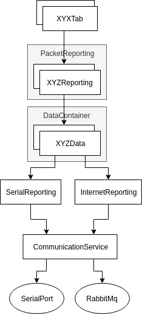

# University of Calgary Solar Car Team Schulich Elysia Telemetry Test Tool
Test tool to mock out the serial telemetry protocol defined in https://docs.google.com/spreadsheets/d/1soVLjeD9Sl7z7Z6cYMyn1fmn-cG7tx_pfFDsvgkCqMU/edit#gid=0.

## Project Setup

In this repo, there are dependencies needed for before you will be able to build or run anything.

Before proceding with the installation, contact the Visual Communication leads to get your conan account set up.

If you don't already have conan installed from another project, run the setup script:

`./EpsilonTestToolSetup.sh`

This will install the [RabbitMQ](https://www.rabbitmq.com/) server and the [Conan](https://conan.io/) package manager. See the links for more information.

## Building

### QT Creator

When first setting up your project with QT creator, you must first add a custom step to allow Conan to install dependencies.

1. Navigate to `Projects -> Build`
2. In `Build Steps`, select `Add Build Step -> Custom Process Step`
3. Add the conan command to the step
   - Command: `$HOME/.local/bin/conan`
   - Arguments: `install ../conanfile.txt --build=missing -s compiler.libcxx="libstdc++11"`
   - Working Directory: `%{buildDir}`
4. Move the step to occur as the first step in the process

### Command Line

1. Create a new directory for your build & navigate into it:

    `mkdir build && cd build`

2. If you were running this on the same terminal you ran the setup script on, reload your environment:
   `source ~/.profile`

3. Install conan dependencies:

    `conan install ../conanfile.txt --build=missing -s compiler.libcxx="libstdc++11"`

3. Call qmake, passing in the directory with the path to the root `EpsilonDashboard.pro` to generate the makefile:

    `qmake ../src/telemTestTool.pro`

- Later, if you need to re-run qmake on the project due to a new UI file or a change to a .pro, call:

    `make qmake_all`

1. Build:

    `make -j4`

## Running the Test tool

To use, create a pair of virtual com ports and connect with this program and the one that you are testing.

## Linux
You can test socat to create Virtual Serial Port doing the following procedure:

Open a terminal (let's call it Terminal 0) and execute the `CreateVirtualPort.sh` script:

```
./CreateVirtualPort.sh
```

The code above returns:

```
2013/11/01 13:47:27 socat[2506] N PTY is /dev/pts/2
2013/11/01 13:47:27 socat[2506] N PTY is /dev/pts/3
2013/11/01 13:47:27 socat[2506] N starting data transfer loop with FDs [3,3] and [5,5]
```

The two ports `/dev/pts/2` and `/dev/pts/3` are now connected.


## Misc Notes

### Useful Rabbitmq Server Commands

#### Start Server

`sudo rabbitmq-server` can be used to start the server on Linux.

#### Refresh Server

On linux to refresh the contents of the server, perform the following commands:
```
rabbitmqctl stop_app
rabbitmqctl reset
rabbitmqctl start_app
```

## Architecture Diagrams

### Data Flow



### Class Diagram


